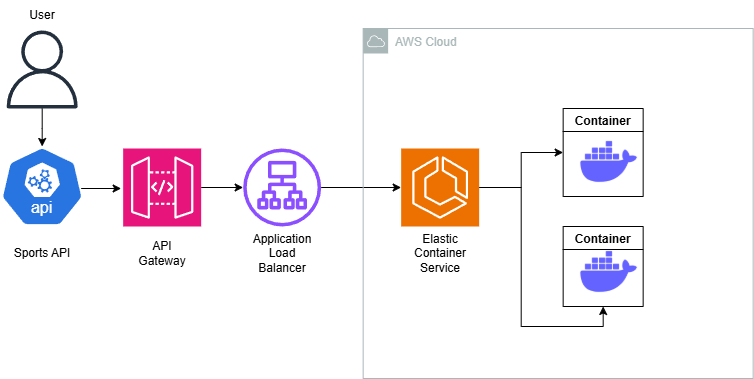

<p align="center">
  
  
## ☁️ 30 Days DevOps Challenge - Building a Containerized API Management System for Querying Sports Data.   ☁️

This is part of the fourth project in the 30-day DevOps challenge! 

In this project, I built


<h2>Environments and Technologies Used</h2>

  - Python
  - Amazon Elastic Container Service
  - Docker
  - API Gateway
  - SerpAPI
  - Github Codespaces for Environment
  - Flask
  - IAM: Least privilege policies for ECS task execution and API Gateway.


  
<h2>Features</h2>  

- 🐳 ***Containerized Scalability:***
Deploy stateless API services using AWS ECS Fargate for auto-scaling containers, reducing infrastructure overhead and costs.
- 🌐 ***RESTful API Gateway:***
Expose sports data via Amazon API Gateway with custom endpoints (e.g., /fixtures, /stats) for easy integration with frontend apps or third-party tools.
- ***⚡ Real-Time Data Fetching:***
Integrate with an external Sports API to deliver live scores, player stats, and match events with low-latency caching strategies.


<h2>Step by Step Instructions</h2>

***1. Repo and API configuration***

We will begin by setting up the environment and code that we will be utilizing. In this instance, we will use `Github Codespaces` to create a new workspace and do the commands from there. We will be setting up an account with RapidAPI for our Serie A Sports data.

You can set environemnt variables within the settings of Codespaces. 

The AWS credentials have the variables `AWS_ACCESS_KEY_ID`, `AWS_SECRET_ACCESS_KEY` and `AWS_DEFAULT_REGION` Respectively.


Finally, we will make sure our dependencies are installed properly.

```
pip install flask
pip install python-dotenv
pip install requests
pip install google-search-results
```

***Option 2: Local AWS CLI Setup***

NOTE: Keep in mind this is for a Linux environment, check the AWS documentation to install it in your supported OS.

   ```
   curl "https://awscli.amazonaws.com/awscli-exe-linux-x86_64.zip" -o "awscliv2.zip"
unzip awscliv2.zip
sudo ./aws/install
```
We then do `AWS configure` and enter our access and secret key along with the region. Output format set to JSON. With this command we will double check that our credentials are put in place for CLI:

```
aws sts get-caller-identity
```


***2. Set up IAM Roles***


***4. Set up our Python file and test***

In this step, we will be setting up our Python file. With this code


***6.  Running the Script - Final Result.***


<h2>Conclusion</h2>

In this project, I learned how you can leverage a Python script to grab API data, send a query to a database and parse it accordingly with Amazon Athena and Glue. I also explored it further by accessing the data generated from the api and using it to generate data visualizers that can display a table or a graph.
